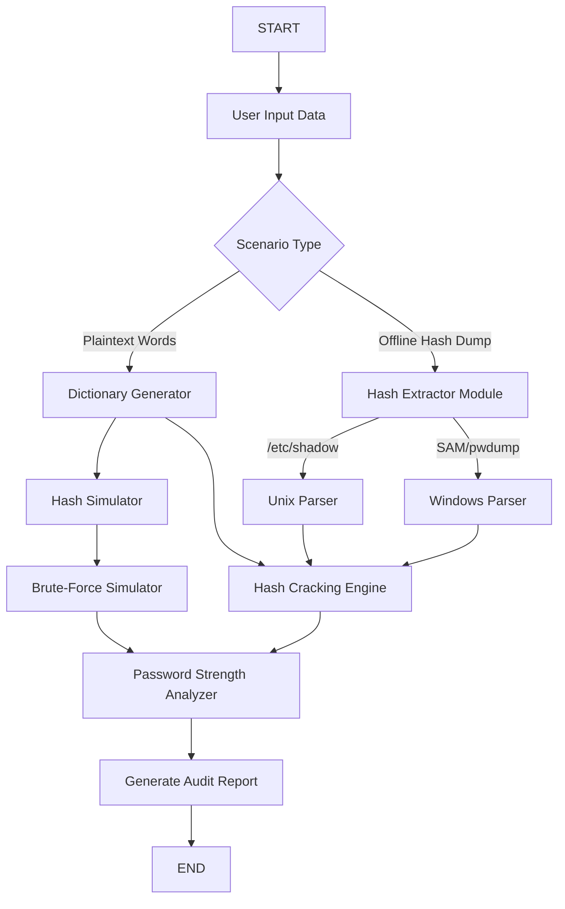

# Credential Fortress Architecture

This document outlines the high-level workflow of the Credential Fortress toolkit, meeting the educational objectives for understanding password strength, extraction, and dictionary attacks.

## Workflow Pipeline

## Module Responsibilities

1. **Dictionary Generator:** Takes base words and applies mutation algorithms (leet-speak, capitalization, numbers) to simulate realistic attacker wordlists.
2. **Hash Extractor (Demo):** Safely parses offline shadow files and Windows pwdump files to extract target hashes without interacting with the live host OS.
3. **Cracking Engine:** Uses `passlib` and raw hashing algorithms to perform actual dictionary attacks against extracted hashes, measuring time-to-crack.
4. **Analyzer:** Evaluates entropy, dictionary weakness, and complexity rules.
